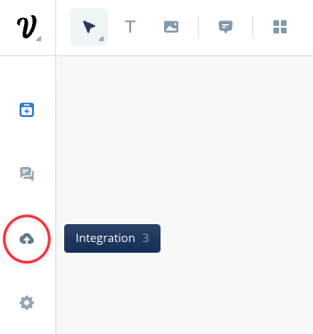
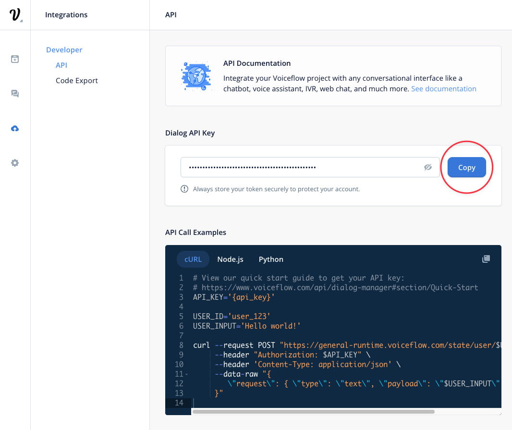
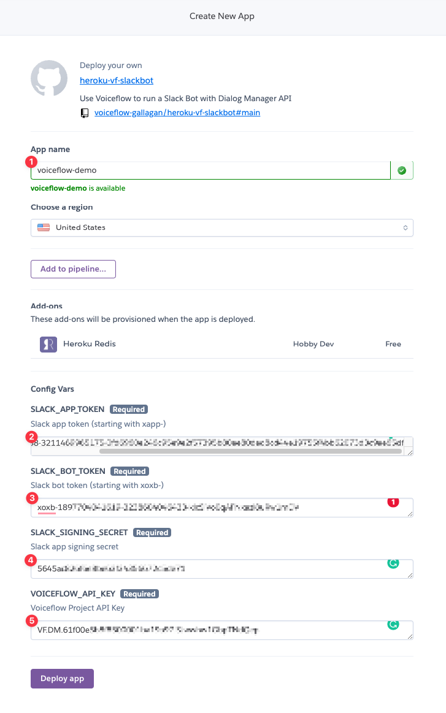
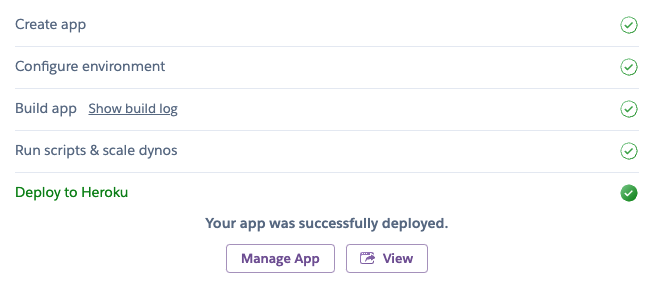

# heroku-vf-slackbot

#### Use Voiceflow Dialog Manager API to run a Slack Bot

# Updates

- Fix for Socket Mode on Heroky

# Prerequisite

- [Heroku](https://www.heroku.com/) account
- [Slack API](https://api.slack.com/) access
- [Voiceflow](https://www.voiceflow.com) Chat Assistant project

# Setup

## 

### Create your Slack App

> Go to to https://api.slack.com/apps?new_app=1 to **create your Slack app**

> Select <mark>**From an app manifest**</mark>

> Select the **workspace** you want to publish the app to

> Choose <mark>**JSON**</mark> on the next screen and paste the manifest bellow

~~~json
{
    "display_information": {
        "name": "Voiceflow Slack Demo",
        "description": "Slack Assistant using Voiceflow Dialog Manager API",
        "background_color": "#37393d"
    },
    "features": {
        "app_home": {
            "home_tab_enabled": true,
            "messages_tab_enabled": true,
            "messages_tab_read_only_enabled": false
        },
        "bot_user": {
            "display_name": "Voiceflow Demo",
            "always_online": true
        }
    },
    "oauth_config": {
        "scopes": {
            "user": [
                "users:read"
            ],
            "bot": [
                "app_mentions:read",
                "channels:history",
                "chat:write",
                "im:history",
                "im:read",
                "im:write",
                "mpim:history",
                "mpim:read",
                "mpim:write",
                "users.profile:read",
                "users:read"
            ]
        }
    },
    "settings": {
        "event_subscriptions": {
            "user_events": [
                "message.app_home",
                "user_change"
            ],
            "bot_events": [
                "app_home_opened",
                "app_mention",
                "message.channels",
                "message.im",
                "message.mpim",
                "user_change"
            ]
        },
        "interactivity": {
            "is_enabled": true
        },
        "org_deploy_enabled": false,
        "socket_mode_enabled": true,
        "token_rotation_enabled": false
    }
}
~~~

> Click **Next** at the bottom of the window

> **Review** the app details and comfirm by clicking on **Create**

> **Install** the newly created app on your workspace

> Click on **Allow** to finish to install the app on your Workspace

### Generate a signin key and tokens

> On the main screen, you want to <mark>**copy the secret key** and **keep it for later**</mark>

> Scroll down and click on **Generate Token and Scopes**

> Give this Token a **name** and add the **connections:write** scope to it. Then click on **Generate**

- Copy the <mark>**app token** and **save it for later**</mark>

> Go to the **OAuth & Permissions** section, <mark>copy the **Bot User OAuth Token** from there and save it for later</mark>

> You should now have:
	a <mark>**secret key**</mark>
	an <mark>**app token**</mark>
	a <mark>**bot token**</mark>

### Get your project Dialog API key

> Go to [Voiceflow Creator](https://creator.voiceflow.com) and open the <mark>**Chat Assistant project**</mark> you want to use

> On your project, click on **Integration** from the left sidebar (or press the **3** key)

> Click **Copy** to <mark>copy your Voiceflow Dialog API Key and save it for later</mark>

### Deploy this code to Heroku

### Setup the Heroku app

> Choose a **name** for your app
> Set the config var with all the info you've previously saved

**SLACK\_APP\_TOKEN**
Slack **app secret** (starting with **xapp-**)

**SLACK\_BOT\_TOKEN**
Slack **bot token** (starting with **xoxb-**)

**SLACK\_SIGNING\_SECRET**
Slack app **signing secret**

**VOICEFLOW\_API\_KEY**
Voiceflow **project API key** (from the Integration section)

> Click on **Deploy app**

> Wait for your app to be fully deployed

## 

### Install your Slack App

> On your Slack workspace, click on **Apps** > **Add apps**

> **Search** for the app name you've created earlier on Slack API website and **click on it** in the Search results list to install it

> The app is now available and you can click on **Messages** to start interacting with your bot.

